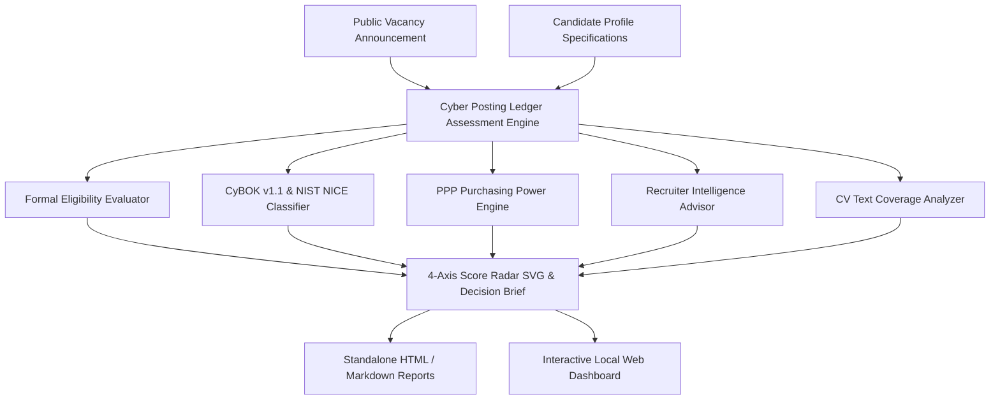

<div align="center">
  <h1>Cyber Posting Ledger</h1>
  <p><em>Assess a cybersecurity vacancy against your own evidence, and keep the reasoning</em></p>

  <p>
    <a href="https://python.org"></a>
    <a href="https://www.cybok.org"></a>
    <a href="https://www.nist.gov/itl/applied-cybersecurity/nice"></a>
    <a href="docs/RELEASE_NOTES.md"></a>
    <a href="#verification--test-suite"></a>
  </p>
</div>

---

## What this is

Cyber Posting Ledger is a local-first tool for assessing cybersecurity vacancies against a structured record of your own experience, using CyBOK v1.1 and the NIST NICE Framework as the vocabulary for the comparison.

Unlike commercial application tracking systems (ATS) that collapse candidate fit into generic percentage matchers (e.g., "78% ATS Match"), Cyber Posting Ledger maintains an auditable evidence ledger across 4 un-aggregated evaluation dimensions:

1. **Formal Eligibility (Hard Gates):** EU/NATO nationality restrictions, degree level, experience years, security clearance (NATO SECRET / SECRET UE), and language proficiencies.
2. **Substantive Role Fit:** CyBOK Knowledge Area taxonomy mapping, NIST NICE Framework role alignment, technical domain match ratio, and NATO/EU operational context bonus.
3. **Strategic Value:** Employer Organization Tier classification (Tier 1 core NATO/EU agencies: NCIA, ENISA, CERT-EU, eu-LISA, Europol, ECCC vs Tier 2/3), brand leverage weight, and long-term ecosystem alignment.
4. **Practical Value:** Net compensation tier, location preference, and Purchasing Power Parity (PPP) cost-of-living salary multipliers.

---

## System Architecture & Modules



---

## Feature Highlights

### 1. Recruiter Intelligence & Certification Roadmap
- Mapped domain-specific certification roadmaps (CISSP, CISA, CISM, GCTI, Security+, ISO 27001 LA, CSSLP) comparing credentials held vs target credentials.
- Generates quantifiable impact templates focused on scale (log volume 50GB+/day, endpoint count 500+), MTTR reduction %, and compliance audit proof.
- Calculates Potential Max Score with actionable step-by-step booster roadmaps.

### 2. CV & Cover Letter Coverage Analyzer
- Scans raw candidate CV or Cover Letter Markdown text against vacancy required domains, technologies, degree levels, and security clearance requirements.
- Returns percentage coverage score, matched keyword list, missing keywords to add, and actionable CV recommendations.

### 3. Purchasing Power Parity (PPP) Calculator
- Computes real purchasing power net salary equivalents relative to Brussels base (1.0x), highlighting cost-of-living advantages (e.g. Athens 1.25x multiplier).

### 4. Interactive 4-Axis Score Radar & Dashboard
- Visualizes fit dimensions on a crisp vector radar chart.
- Includes candidate scenario switching (Current Profile, Post-Thesis Target Profile, NATO CIS Specialist).
- Minimalist visual language adhering to a gallery aesthetic (warm paper canvas, deep teal accents, monospaced numeric scores).

---

## Quick Start

You need Python 3.10 or newer. Check with `python3 --version`; if that fails,
install Python from [python.org](https://www.python.org/downloads/).

**1. Get the code and go into the folder.**

```bash
git clone https://github.com/v-k-tsalikidis/Cyber-Posting-Ledger.git
```

```bash
cd cyber-posting-ledger
```

**2. Create an isolated environment and install.** The virtual environment
keeps this project's packages away from the rest of your system.

```bash
python3 -m venv .venv && source .venv/bin/activate && pip install -e .
```

On Windows PowerShell, activate with `.venv\Scripts\Activate.ps1` instead.

**3. See it working.** The tool ships with three example vacancies, so there
is something to look at before you add your own.

```bash
cyber-posting-ledger list
```

You get a table of vacancies with four scores each: formal eligibility,
substantive fit, strategic value, and practical value. They are kept separate
on purpose. A role you are formally eligible for can still be a poor fit, and
collapsing that into one number hides the thing you actually need to decide.

**4. Look at one in detail.**

```bash
cyber-posting-ledger score --id VAC-001
```

This shows how each score was reached, so you can disagree with it.

### The rest of the commands

```bash
cyber-posting-ledger generate-brief --id VAC-001
```

Writes an application brief for that vacancy: which of your evidence lines up
with which requirement, and where the gaps are.

```bash
cyber-posting-ledger analyze-cv --id VAC-001 --cv-file my_cv.md
```

Compares your CV text against the vacancy's requirements and reports what the
vacancy asks for that your CV does not mention.

```bash
cyber-posting-ledger export-html --id VAC-001 --out report.html
```

Writes a single self-contained HTML file you can open in a browser or send on.

```bash
cyber-posting-ledger serve --port 8000
```

Opens the same data as a small web dashboard at
[http://localhost:8000](http://localhost:8000). Press `Ctrl+C` to stop it.

### If something goes wrong

- `command not found: cyber-posting-ledger` — the virtual environment is not active.
  Run `source .venv/bin/activate` from the project folder.
- `Address already in use` — something else holds port 8000. Use
  `--port 8001`.

Everything runs on your machine. Nothing is uploaded, and the tool makes no
network calls of its own.

## Verification & Test Suite

Run the full pytest unit test suite:
```bash
python3 -m pytest
```
*17 passed out of 17 tests (100% pass rate in 0.07s).*

---

## Documentation & Specifications

- [`docs/BRAND_STYLE_GUIDE.md`](docs/BRAND_STYLE_GUIDE.md) - Design System, Color Tokens & Logo Specifications
- [`docs/RECRUITER_INTELLIGENCE.md`](docs/RECRUITER_INTELLIGENCE.md) - Recruiter Evaluation Logic & Certification Roadmaps
- [`docs/RELEASE_NOTES.md`](docs/RELEASE_NOTES.md) - Release History & Version Changelog (v0.4.0)

---

*Cyber Posting Ledger &bull; Personal Confidential Career Evidence &bull; Academic & Recruiter Grounded*
