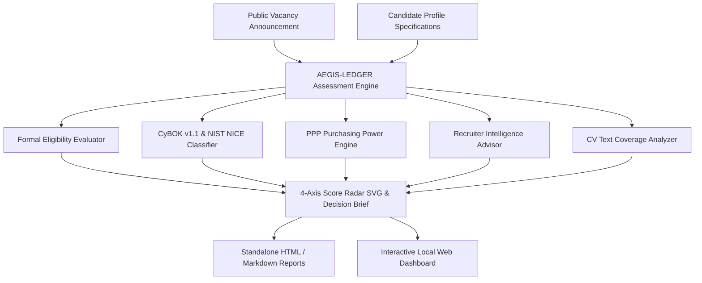

<div align="center">
  
  <h1>AEGIS-LEDGER</h1>
  <p><em>Academic &amp; Recruiter-Grounded Cybersecurity Career Intelligence Platform</em></p>

  <p>
    <a href="https://python.org"></a>
    <a href="https://www.cybok.org"></a>
    <a href="https://www.nist.gov/itl/applied-cybersecurity/nice"></a>
    <a href="docs/RELEASE_NOTES.md"></a>
    <a href="#verification--test-suite"></a>
  </p>
</div>

---

## Executive Summary

AEGIS-LEDGER is an enterprise-grade, local-first decision platform designed to evaluate cybersecurity job opportunities against rigorous academic frameworks (CyBOK v1.1, NIST NICE Framework) and empirical Recruiter Intelligence.

Unlike commercial application tracking systems (ATS) that collapse candidate fit into generic percentage matchers (e.g., "78% ATS Match"), AEGIS-LEDGER maintains an auditable evidence ledger across 4 un-aggregated evaluation dimensions:

1. **Formal Eligibility (Hard Gates):** EU/NATO nationality restrictions, degree level, experience years, security clearance (NATO SECRET / SECRET UE), and language proficiencies.
2. **Substantive Role Fit:** CyBOK Knowledge Area taxonomy mapping, NIST NICE Framework role alignment, technical domain match ratio, and NATO/EU operational context bonus.
3. **Strategic Value:** Employer Organization Tier classification (Tier 1 core NATO/EU agencies: NCIA, ENISA, CERT-EU, eu-LISA, Europol, ECCC vs Tier 2/3), brand leverage weight, and long-term ecosystem alignment.
4. **Practical Value:** Net compensation tier, location preference, and Purchasing Power Parity (PPP) cost-of-living salary multipliers.

---

## System Architecture & Modules



---

## Feature Highlights

### 1. Recruiter Intelligence & Certification Roadmap
- Mapped domain-specific certification roadmaps (CISSP, CISA, CISM, GCTI, Security+, ISO 27001 LA, CSSLP) comparing credentials held vs target credentials.
- Generates quantifiable impact templates focused on scale (log volume 50GB+/day, endpoint count 500+), MTTR reduction %, and compliance audit proof.
- Calculates Potential Max Score with actionable step-by-step booster roadmaps.

### 2. CV & Cover Letter Coverage Analyzer
- Scans raw candidate CV or Cover Letter Markdown text against vacancy required domains, technologies, degree levels, and security clearance requirements.
- Returns percentage coverage score, matched keyword list, missing keywords to add, and actionable CV recommendations.

### 3. Purchasing Power Parity (PPP) Calculator
- Computes real purchasing power net salary equivalents relative to Brussels base (1.0x), highlighting cost-of-living advantages (e.g. Athens 1.25x multiplier).

### 4. Interactive 4-Axis Score Radar & Dashboard
- Visualizes fit dimensions on a crisp vector radar chart.
- Includes candidate scenario switching (Current Profile, Post-Thesis Target Profile, NATO CIS Specialist).
- Minimalist visual language adhering to a gallery aesthetic (warm paper canvas, deep teal accents, monospaced numeric scores).

---

## Installation & Quick Start

```bash
# Clone repository
git clone https://github.com/v-k-tsalikidis/aegis-ledger.git
cd aegis-ledger

# Install in editable mode
pip install -e .
```

### Run Web Dashboard UI
```bash
python3 -m cyber_vacancy_tracker.cli serve --port 8000
```
Open **[http://localhost:8000](http://localhost:8000)** in your browser.

### Run CLI Commands
```bash
# List tracked vacancies and fit scores
cyber-vacancy-tracker list

# Detailed multi-dimensional evaluation
cyber-vacancy-tracker score --id VAC-001

# Generate Application Alignment Brief
cyber-vacancy-tracker generate-brief --id VAC-001

# Analyze CV text coverage against vacancy requirements
cyber-vacancy-tracker analyze-cv --id VAC-001 --cv-file my_cv.md

# Export publication-quality standalone HTML report
cyber-vacancy-tracker export-html --id VAC-001 --out report.html
```

---

## Verification & Test Suite

Run the full pytest unit test suite:
```bash
python3 -m pytest
```
*17 passed out of 17 tests (100% pass rate in 0.07s).*

---

## Documentation & Specifications

- [`docs/BRAND_STYLE_GUIDE.md`](docs/BRAND_STYLE_GUIDE.md) - Design System, Color Tokens & Logo Specifications
- [`docs/RECRUITER_INTELLIGENCE.md`](docs/RECRUITER_INTELLIGENCE.md) - Recruiter Evaluation Logic & Certification Roadmaps
- [`docs/RELEASE_NOTES.md`](docs/RELEASE_NOTES.md) - Release History & Version Changelog (v0.4.0)

---

*AEGIS-LEDGER &bull; Personal Confidential Career Evidence &bull; Academic & Recruiter Grounded*
