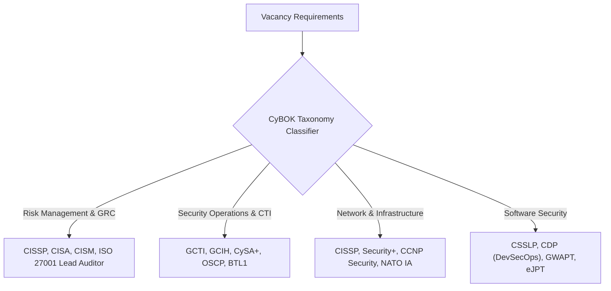

# Recruiter Intelligence & Career Path Advisory Engine

**Cyber Posting Ledger** includes a specialized **Recruiter Intelligence & Career Path Advisory Engine**, translating cybersecurity recruiter search behavior, certification requirements, and quantifiable impact metrics into automated, actionable candidate career advice.

---

## 1. Core Recruiter Evaluation Factors

Cybersecurity recruiters filter CVs for specific evidence rather than generic task lists:

| Recruiter Focus Area | How Cyber Posting Ledger Evaluates & Advises |
| :--- | :--- |
| **Hard Tech Stacks & Tools** | Scans for specific tool proficiencies (e.g. *Splunk, Wireshark, CrowdStrike, Python, Linux, Neo4j*) mapped to CyBOK Knowledge Areas. |
| **Industry Certifications** | Maps candidate certifications held against domain-specific must-have credentials (e.g., *CISSP, CISA, CISM, GCTI, Security+, ISO 27001 LA*). |
| **Quantifiable Impact Metrics** | Generates tailored bullet templates with scale metrics (log volume `50GB+/day`, endpoint count `500+`, MTTR reduction `%`, compliance coverage `100%`). |
| **Multi-Agency & NATO/EU Context** | Evaluates operational experience across multinational environments and clearance levels (*NATO SECRET, SECRET UE*). |

---

## 2. Certification Mapping Matrix

The engine dynamically classifies vacancies into **CyBOK v1.1 Knowledge Areas** and maps target certification roadmaps:

---

## 3. Quantifiable Impact Template Generator

Recruiters look for **proven results** rather than passive duty descriptions. The system generates customizable bullet points for CV tailoring:

* **Scale & Scope:** *"Managed security controls and risk assessments across an operational footprint of 500+ endpoints and 50GB/day log ingestion in a multi-agency EU/NATO context."*
* **MTTR & Risk Reduction:** *"Reduced Mean-Time-To-Respond (MTTR) by 35% through standardized incident response playbooks and automated threat intelligence triage."*
* **Compliance & Audit Success:** *"Successfully conducted internal compliance audits against NIST CSF 2.0 and ISO 27001, closing 100% of high-risk audit findings within 30 days."*

---

## 4. Score Booster Roadmap

Calculates **Potential Max Score** with actionable steps:

1. **Step 1: Recruiter Keyword & Metric Quantify (+10 pts)**
   Format CV experience bullets with explicit scale metrics (log volume, MTTR %, endpoint count) and tool names.
2. **Step 2: Certification Gain (+10 pts)**
   Obtain target credentials (e.g. CISSP or CySA+) to bypass initial HR keyword filters.
3. **Step 3: Lab & Portfolio Evidence (+10 pts)**
   Attach links to open-source GitHub projects, CTF write-ups, or CyBOK knowledge area mappings.
